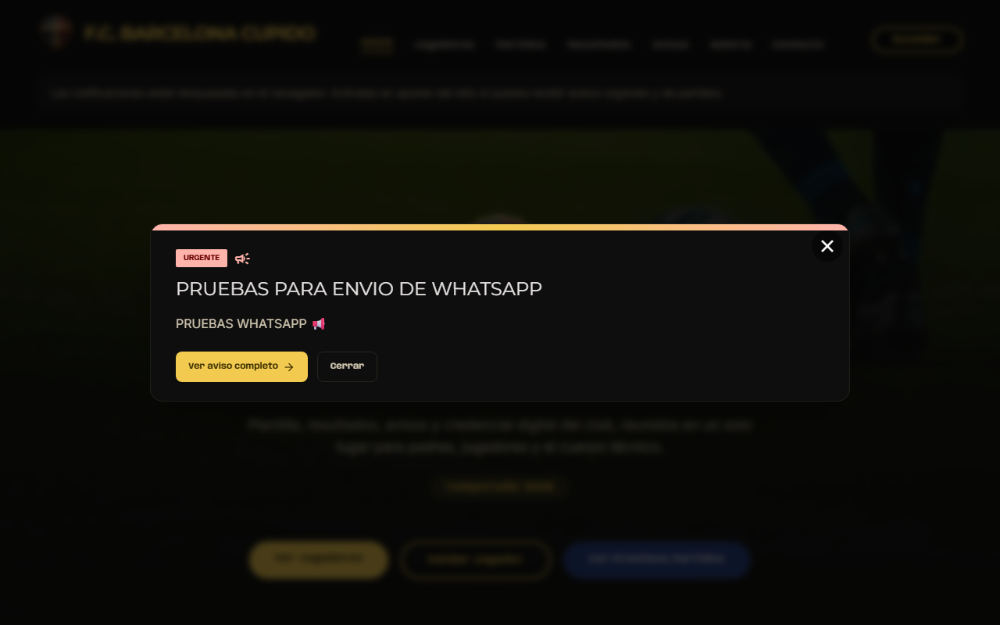
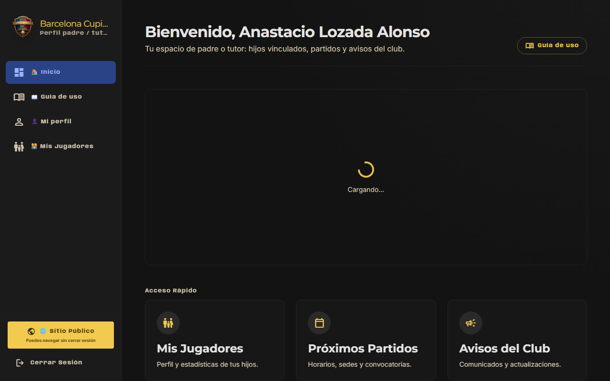
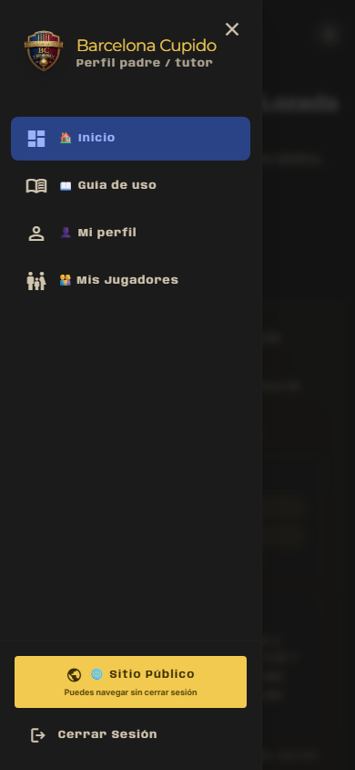

# Instalar la app en el teléfono o computadora

El sitio **F.C. Barcelona Cupido** se puede usar en el navegador o **instalado como app** (acceso directo en la pantalla de inicio). No hay que descargar nada de la App Store ni de Google Play: es la misma web, guardada como acceso directo.

**Dirección:** https://barcelona-chalco.pages.dev

---

## Android (Chrome u otro navegador)

1. Abre **Chrome** y entra a https://barcelona-chalco.pages.dev
2. Inicia sesión si ya tienes cuenta (padres: `/login`).
3. Menú **⋮** (tres puntos) → **«Instalar aplicación»** o **«Añadir a pantalla de inicio»**.
4. Confirma el nombre (p. ej. «Barcelona Cupido») y pulsa **Instalar** o **Añadir**.
5. Abre la app desde el **icono nuevo** en la pantalla de inicio.

**Notificaciones en Android:** tras instalar o desde el panel, pulsa **«Activar avisos»** cuando aparezca el banner y acepta el permiso del navegador.

---

## iPhone / iPad (Safari)

Apple **no** permite notificaciones si solo abres Safari normal. Para avisos push debes instalar la app en la pantalla de inicio:

1. Abre **Safari** (no Chrome en iOS para este paso).
2. Entra a https://barcelona-chalco.pages.dev e inicia sesión.
3. Pulsa **Compartir** (cuadrado con flecha hacia arriba).
4. Baja y elige **«Añadir a pantalla de inicio»**.
5. Pon un nombre (p. ej. «Barcelona Cupido») y **Añadir**.
6. Abre siempre el sitio desde el **icono en la pantalla de inicio**, no desde Safari.
7. En el panel (Inicio del dashboard), pulsa **«Activar avisos»** y acepta **Permitir**.

> **Captura en iPhone:** el paso «Compartir → Añadir a pantalla de inicio» conviene fotografiarlo en un iPhone real; no se puede generar automáticamente desde el script de capturas.

Si no ves «Añadir a pantalla de inicio», actualiza iOS y usa Safari (no modo lectura privada).

---

## Computadora (Windows / Mac)

### Chrome o Edge

1. Entra a https://barcelona-chalco.pages.dev
2. En la barra de direcciones, icono **«Instalar»** (⊕ o monitor con flecha), o menú → **«Instalar Barcelona Cupido…»**.
3. La app se abre en una ventana propia.

### Mac con Safari

Puedes usar el sitio en pestaña y activar **avisos push** desde el panel sin instalar (Safari en Mac lo permite). Opcional: **Archivo → Añadir al Dock** (macOS Sonoma+) si tu versión lo ofrece.

---

## ¿Instalé bien?

- Al abrir desde el icono, no debe verse la barra completa de Safari (modo app / pantalla completa).
- En el panel, el banner de avisos debe permitir **Activar avisos** (en iPhone solo si abriste desde el icono de inicio).

---

## Problemas frecuentes

| Problema | Qué hacer |
|----------|-----------|
| No aparece «Instalar» | Usa Chrome en Android o Safari en iPhone; recarga la página. |
| En iPhone no llegan avisos | Abre desde el **icono de inicio**, no desde Safari. |
| «Avisos bloqueados» | Ajustes del teléfono → Safari/Chrome → Notificaciones → permitir para el sitio. |
| Olvidé la contraseña | https://barcelona-chalco.pages.dev/olvide-contraseña |

Soporte del club: https://barcelona-chalco.pages.dev/soporte
