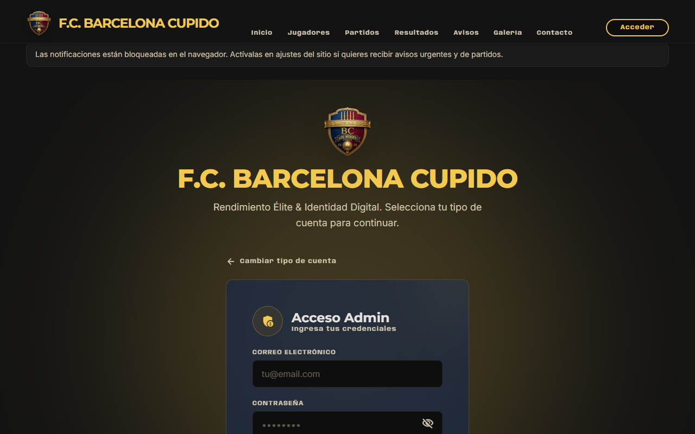
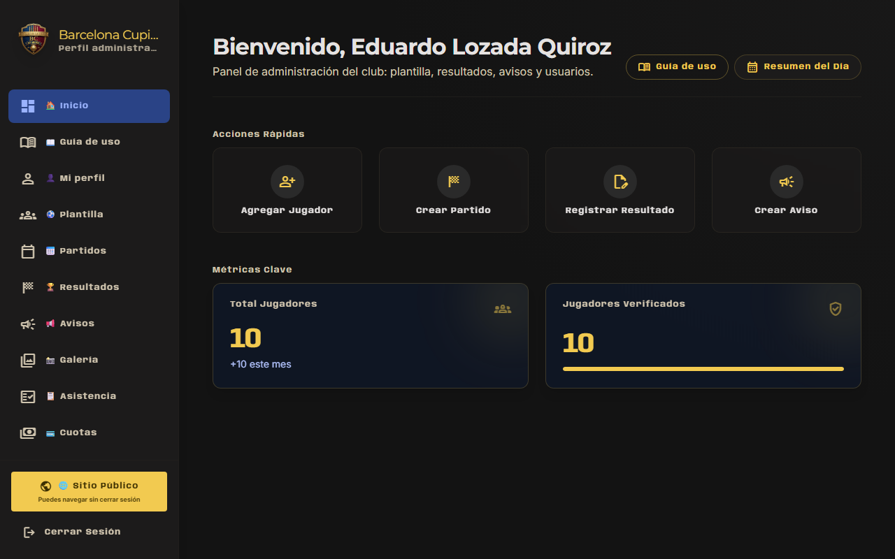
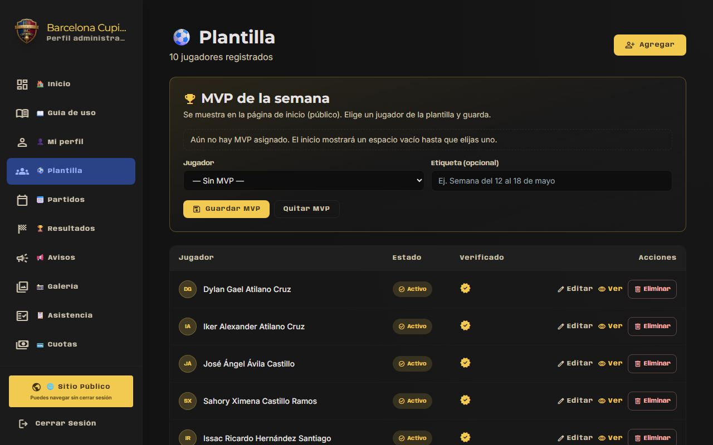
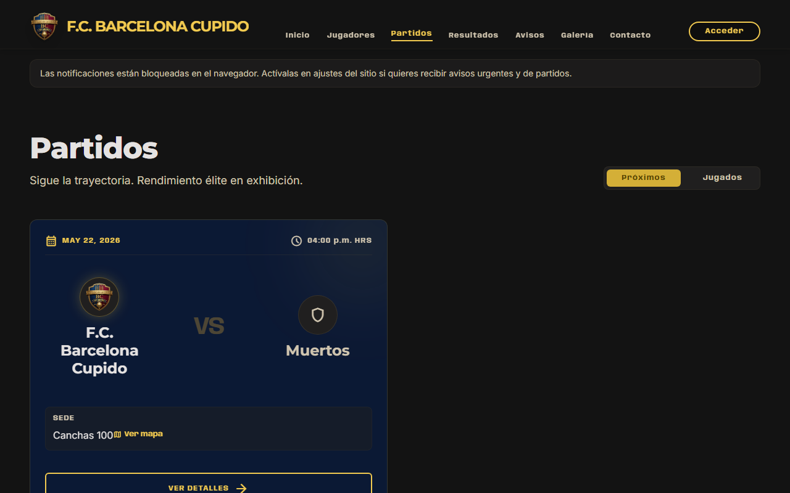
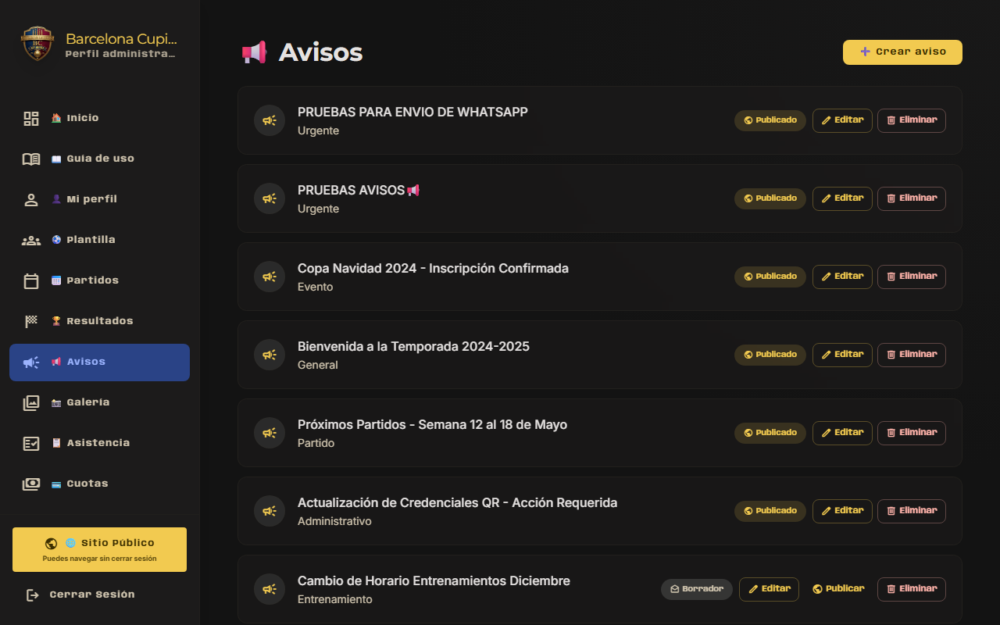
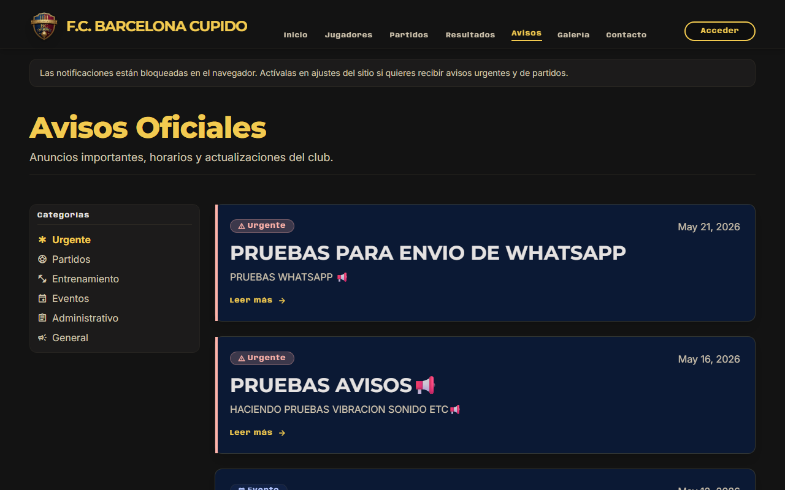
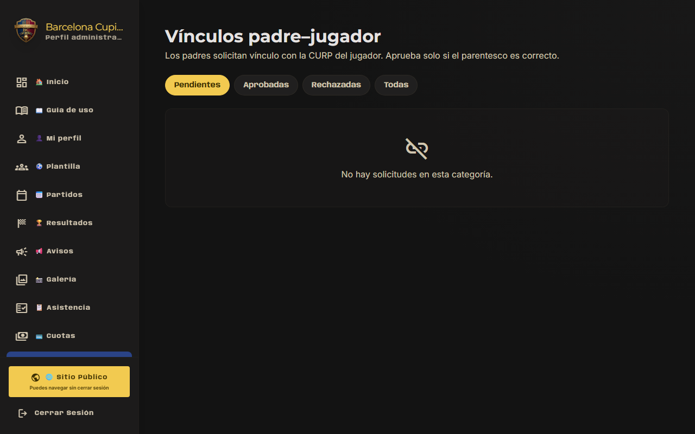
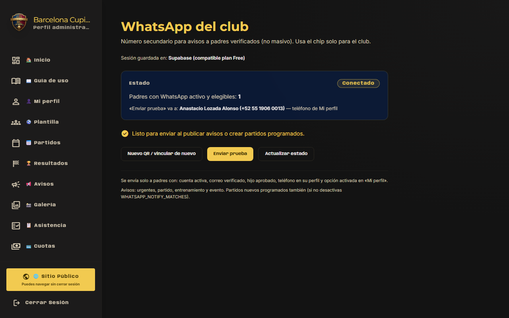

# Tutorial para administradores

**F.C. Barcelona Cupido** — Gestión del club en el panel de administración.

- **Panel:** https://barcelona-chalco.pages.dev/login (rol administrador)  
- **Sitio público:** https://barcelona-chalco.pages.dev  

---

## 1. Acceso y roles

| Rol | Qué puede hacer |
|-----|------------------|
| **Administrador** | Todo: usuarios, ajustes, cuotas, asistencia, WhatsApp del club |
| **Entrenador** | Plantilla, partidos, resultados, avisos, galería, vínculos padres (sin usuarios ni ajustes globales) |
| **Padre/tutor** | Solo su panel y sitio público |

Crear entrenadores: **Usuarios** → nuevo usuario con rol entrenador.

---

## 2. Flujo recomendado (orden)

1. **Ajustes** — temporada actual, colores, correo de contacto público del club  
2. **Plantilla** — alta de jugadores (CURP, categoría, foto)  
3. **Usuarios / registro padres** — padres se registran solos o tú los das de alta  
4. **Vínculos padres** — aprobar solicitudes CURP  
5. **Partidos** y **Resultados** — calendario y marcadores publicados  
6. **Avisos** y **Galería** — comunicación  
7. **Cuotas** / **Asistencia** — control interno  
8. **WhatsApp** — vincular número del club y enviar pruebas  

---

## 3. Plantilla (`/dashboard/players`)

- Crear jugador: nombre, categoría, **CURP** (18 caracteres), foto, datos físicos si aplica  
- La **CURP** es la que el padre usará para vincularse  
- Editar / dar de baja según política del club  
- Perfil del jugador: credencial QR, estadísticas si hay resultados  

---

## 4. Partidos (`/dashboard/matches`)

- Crear partido: rival, fecha, hora, sede, categoría, logo rival opcional  
- Estados: programado, en juego, finalizado (según uso del club)  
- Al crear partido **programado** puede enviarse aviso automático por **WhatsApp** (si está conectado)  
- Lo publicado se ve en **Sitio público → Partidos**  

---

## 5. Resultados (`/dashboard/results`)

- Registrar marcador local / visita  
- Estado **Publicado** para que cuente en tablas del inicio público  
- **Goles y tarjetas** — estadísticas por jugador  

---

## 6. Avisos (`/dashboard/notices`)

Tipos útiles:

| Tipo | Uso | Push | WhatsApp |
|------|-----|------|----------|
| Urgente | Comunicado importante | Sí | Sí |
| Partido | Relacionado a juego | Sí | Sí |
| Entrenamiento | Sesiones | Sí | Sí |
| Evento | Actividades | Sí | Sí |
| General | Solo web | No automático | No |

Al **publicar**, los padres elegibles reciben **notificación push** (si la activaron) y **WhatsApp** (si tienen opt-in y teléfono válido).

**Prueba:** publica un aviso **Urgente** de prueba con texto «Prueba – ignorar» y confirma recepción en un padre de prueba.

---

## 7. Galería (`/dashboard/gallery`)

- Subir fotos de partidos o entrenamientos  
- Título y descripción  
- Visible en sitio público → Galería  

---

## 8. Vínculos padres (`/dashboard/link-requests`)

- Lista solicitudes con CURP  
- **Aprobar** si coincide con un jugador de plantilla  
- **Rechazar** si es incorrecta o duplicada  
- Sin aprobación el padre no ve datos privados del hijo  

---

## 9. Usuarios (`/dashboard/users`)

- Crear **admin** o **entrenador**  
- Activar / suspender cuentas  
- Desbloquear tras intentos fallidos  
- El **correo de login** no es el mismo que el «correo de contacto» en Ajustes  

---

## 10. Ajustes (`/dashboard/settings`)

- **Temporada** actual (afecta perfiles y datos de temporada)  
- Identidad visual / textos del club en sitio público  
- Correo o datos de contacto mostrados a familias  

---

## 11. Cuotas (`/dashboard/fees`) y Asistencia (`/dashboard/attendance`)

- **Cuotas:** registro y mensualidad por jugador / periodo  
- **Asistencia:** pase de lista en entrenamientos  
- Los padres ven resumen en su **Inicio** (no montos sensibles de otros jugadores)  

---

## 12. Comentarios (`/dashboard/comments`)

- Moderar comentarios del sitio público si están habilitados  

---

## 13. WhatsApp del club (`/dashboard/whatsapp`)

Número del club (ej. chip **3349420820**) vinculado por **QR** — solo administración.

### Primera configuración

1. En Render: `WHATSAPP_ENABLED=true` (ya debe estar en producción)  
2. Panel → **WhatsApp** → estado **Conectado**  
3. En el teléfono del club: WhatsApp → Dispositivos vinculados → escanear QR del panel  
4. **Nuevo QR** solo si cerraste sesión o cambiaste de chip (no pulsar mientras alguien escanea)  

Documentación técnica: [WHATSAPP_BAILEYS.md](../WHATSAPP_BAILEYS.md)

### Envío a padres

Solo padres que:

- Tienen cuenta activa y correo verificado  
- Hijo **aprobado**  
- Teléfono en **Mi perfil**  
- Activaron **avisos por WhatsApp** en su panel  

**Enviar prueba** — un mensaje al primer padre elegible (revisar línea «va a: Nombre (teléfono)»).

**Avisos reales** — al publicar aviso urgente/partido/entrenamiento/evento se envía a **todos** los elegibles, con pausa entre mensajes.

### Números

| Número | Rol |
|--------|-----|
| Chip del club (QR) | **Envía** mensajes |
| Celular en Mi perfil del padre | **Recibe** mensajes |

---

## 14. Sitio público vs panel

- **Sitio público** — lo que ve cualquier visitante  
- **Panel** — gestión privada  
- El botón dorado **Sitio público** en el menú no cierra la sesión  
- Tras publicar, revisa en `/avisos` o `/partidos` cómo se ve  

---

## 15. Instalar el panel como app (opcional)

En celular o laptop puedes instalar https://barcelona-chalco.pages.dev como acceso directo: ver [INSTALAR_APP.md](./INSTALAR_APP.md).

---

## Checklist semanal sugerido

- [ ] Revisar vínculos padres pendientes  
- [ ] Partidos de la semana creados  
- [ ] Resultados publicados  
- [ ] WhatsApp **Conectado** en panel  
- [ ] Aviso urgente de prueba tras cambio de temporada o chip  

---

## Soporte técnico

- Logs del backend: Render → servicio `barcelona-chalco-backend`  
- Frontend: Cloudflare Pages  
- Base de datos: Supabase  

---

*Documento para administradores — F.C. Barcelona Cupido. Mayo 2026.*
