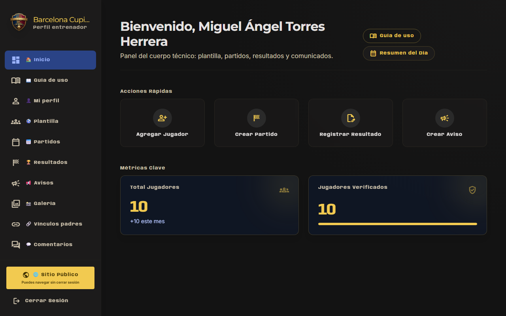
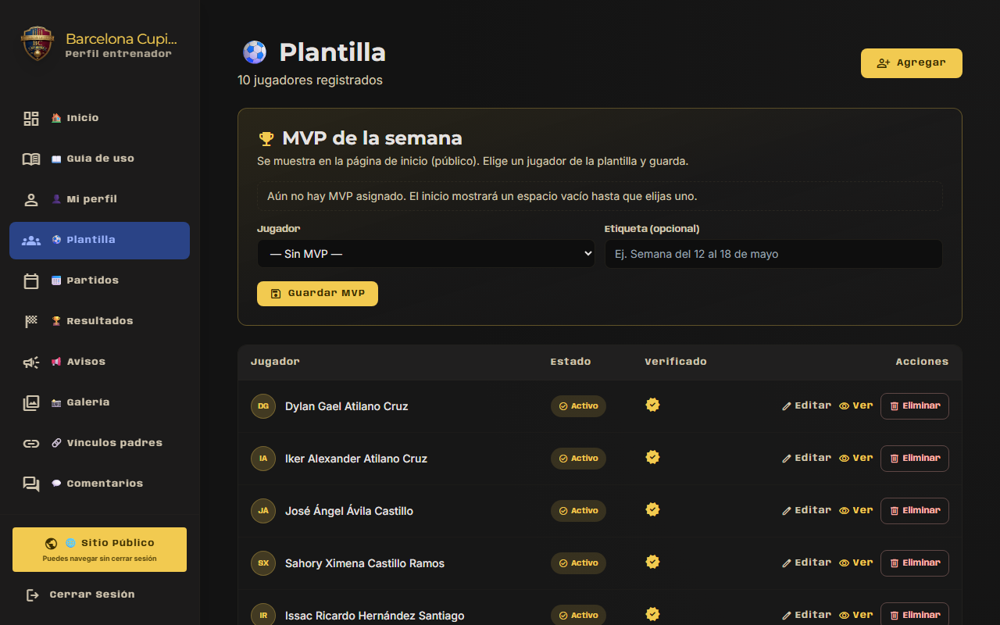
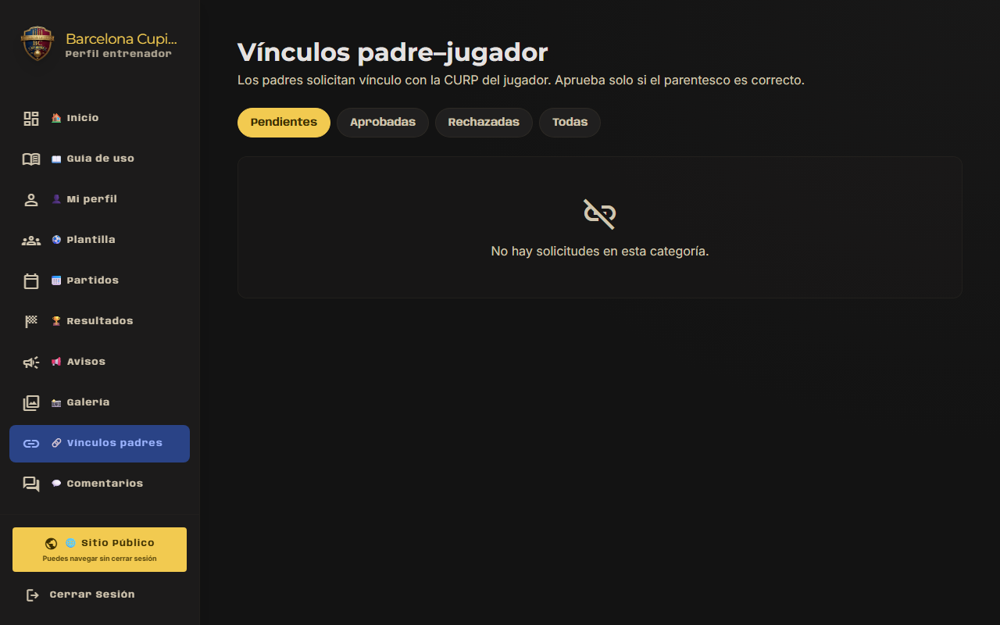

# Tutorial para entrenadores

**F.C. Barcelona Cupido** — Uso del panel de entrenador.

- **Entrar:** https://barcelona-chalco.pages.dev/login  
- **Guía en el sitio:** Panel → **Guía de uso**  

---

## Qué puedes hacer

Igual que el administrador en operación diaria, **excepto**:

- No tienes **Usuarios**
- No tienes **Ajustes** del club
- No tienes **Cuotas**, **Asistencia** ni **WhatsApp** (solo admin)

Sí tienes:

| Sección | Uso |
|---------|-----|
| **Plantilla** | Ver y editar jugadores |
| **Partidos** | Calendario |
| **Resultados** | Marcador y goles/tarjetas |
| **Avisos** | Comunicados (urgente, partido, etc.) |
| **Galería** | Fotos |
| **Vínculos padres** | Aprobar CURP |

---

## Tareas habituales

### Después de un partido

1. **Resultados** → registrar marcador → **Publicado**  
2. **Goles y tarjetas** por jugador  
3. Opcional: foto en **Galería** y aviso tipo **Partido**  

### Nuevo jugador en el equipo

1. Pide datos al club o al admin si la alta es solo administración  
2. Si tienes acceso: **Plantilla** → nuevo jugador con **CURP** correcta  
3. Comunica la CURP al padre para que vincule en **Mis jugadores**  

### Padre no ve a su hijo

1. **Vínculos padres** → revisar solicitud pendiente  
2. Comprobar que la CURP coincide con la de plantilla  
3. **Aprobar** o pedir al padre que corrija la solicitud  

### Aviso urgente

1. **Avisos** → nuevo → tipo **Urgente** → publicar  
2. Los padres con notificaciones activas reciben push; con WhatsApp activo, mensaje del club  

---

## Instalar el panel en el celular

Ver [INSTALAR_APP.md](./INSTALAR_APP.md) — útil para revisar el calendario y publicar avisos desde el campo.

---

## Resumen

| Tarea | Menú |
|-------|------|
| Aprobar padre–hijo | Vínculos padres |
| Subir resultado | Resultados |
| Aviso de entrenamiento | Avisos |
| Foto del partido | Galería |
| Ver CURP de un jugador | Plantilla → jugador |

---

*Documento para entrenadores — F.C. Barcelona Cupido. Mayo 2026.*
