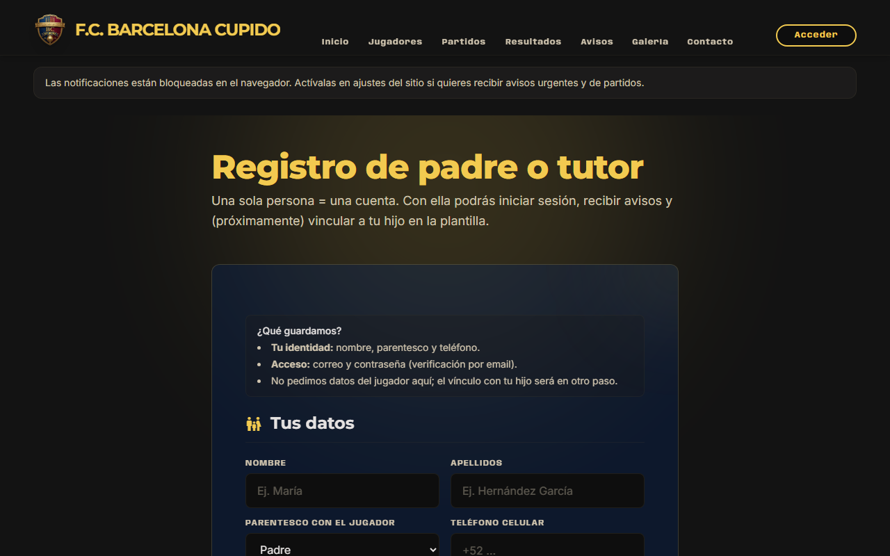
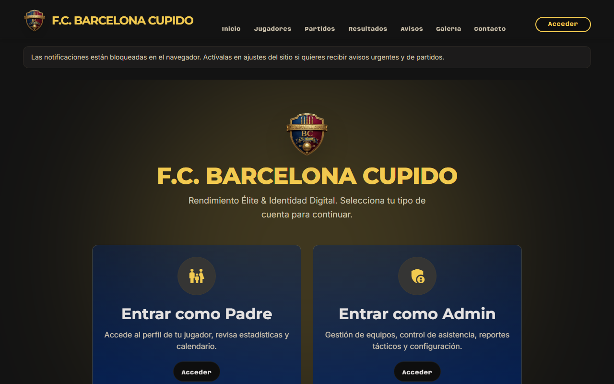
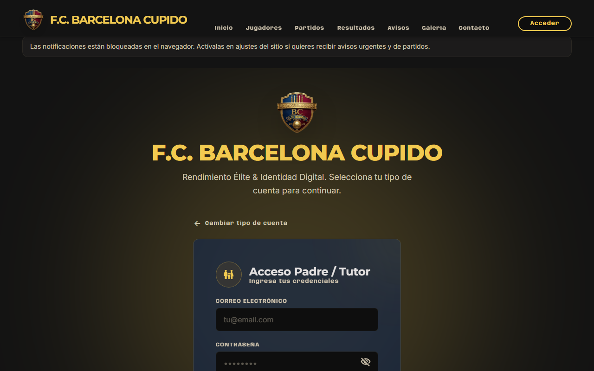
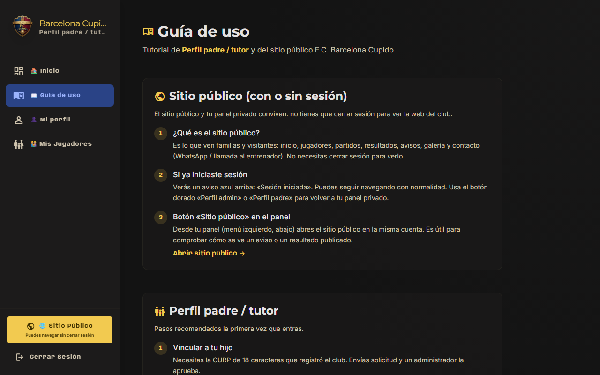
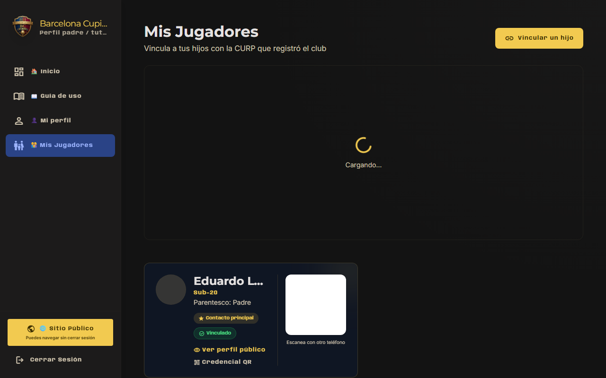
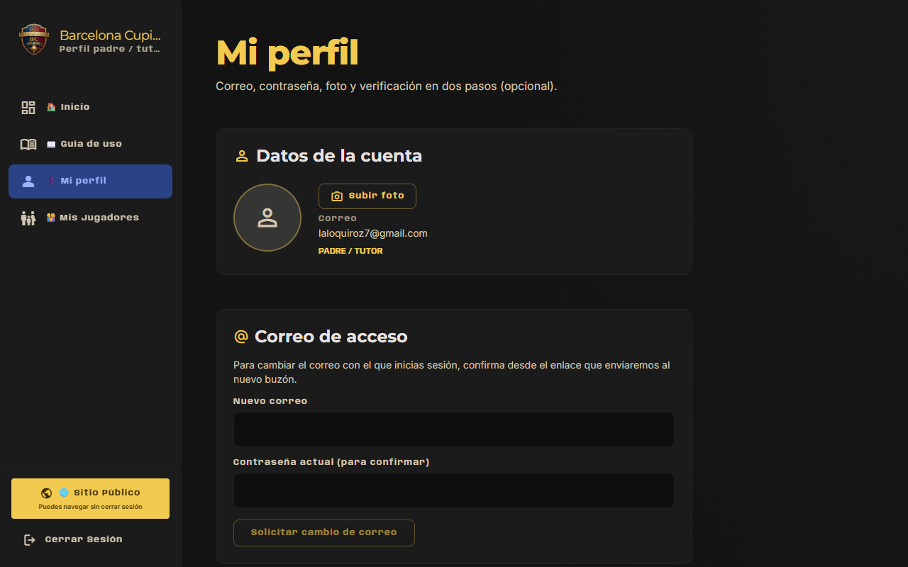
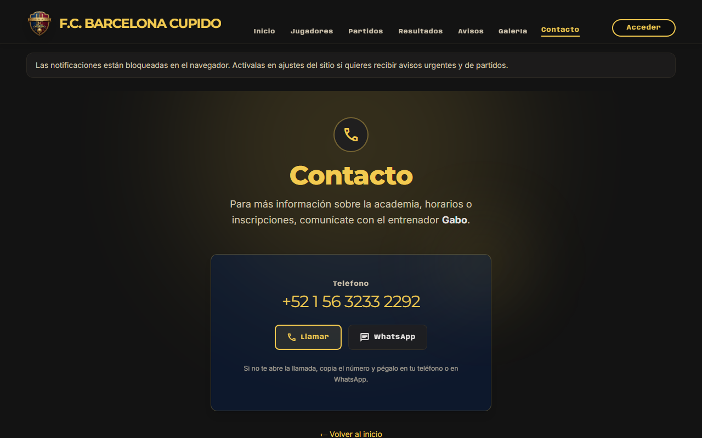

# Tutorial para padres y tutores

**F.C. Barcelona Cupido** — Cómo usar el sitio y el panel privado.

- **Sitio público:** https://barcelona-chalco.pages.dev  
- **Entrar a tu cuenta:** https://barcelona-chalco.pages.dev/login  
- **Registro (primera vez):** https://barcelona-chalco.pages.dev/register  

---

## 1. Primera vez: crear tu cuenta

1. Entra a **Registro** y completa:
   - Correo (será tu usuario)
   - Contraseña (mínimo 8 caracteres, mayúscula, número y símbolo)
   - Nombre del padre/tutor y datos del menor según el formulario
   - **Teléfono** (10 dígitos, el celular donde quieres recibir avisos)
2. Revisa tu **correo** y abre el enlace **«Verificar correo»**.
3. Sin verificar el correo no podrás usar todas las funciones.

---

## 2. Instalar la app en el celular (recomendado)

Para tener acceso rápido y **notificaciones** en el teléfono:

- **Android:** ver [INSTALAR_APP.md](./INSTALAR_APP.md) → Chrome → Añadir a pantalla de inicio.
- **iPhone:** Safari → Compartir → **Añadir a pantalla de inicio** → abrir siempre desde el icono.

---

## 3. Iniciar sesión y menú del panel

1. Abre https://barcelona-chalco.pages.dev/login
2. Pulsa **Entrar como Padre**, escribe correo y contraseña → **Iniciar sesión**.
3. Menú lateral (o ☰ en celular):
   - **Inicio** — resumen y avisos de activar notificaciones
   - **Guía de uso** — pasos rápidos dentro del sitio
   - **Mi perfil** — nombre, teléfono, contraseña, foto
   - **Mis jugadores** — vincular hijos con CURP
4. Abajo: **Sitio público** (ver calendario sin cerrar sesión) y **Cerrar sesión**.

---

## 4. Vincular a tu hijo (CURP)

1. Ve a **Mis jugadores**.
2. Pide la **CURP de 18 caracteres** del jugador al club (la misma que en la plantilla).
3. Envía la **solicitud de vínculo**.
4. Un **administrador o entrenador** debe **aprobarla** (Vínculos padres en su panel).
5. Cuando esté aprobada, verás a tu hijo en la lista y podrás abrir su perfil y credencial QR.

---

## 5. Qué puedes ver

### En el panel (privado)

- Estado de **cuotas** (registro y mensualidad del mes)
- **Asistencia** de tu hijo al entrenamiento
- Opción de **avisos por WhatsApp** del club (si cumples requisitos)

### En el sitio público (todos)

Sin cerrar sesión puedes ver:

- **Partidos** — calendario  
- **Resultados** — marcadores  
- **Avisos** — comunicados del club  
- **Galería** — fotos  
- **Jugadores** — perfiles públicos  

Botón **Sitio público** en el panel te lleva ahí con tu sesión activa.

---

## 6. Avisos en el teléfono (push)

1. Entra al **panel** (mejor desde la app instalada).
2. Si aparece el banner **«Recibe avisos en el teléfono»**, pulsa **Activar avisos** y acepta.
3. Recibirás notificación cuando publiquen algo **urgente**, de **partido**, **entrenamiento** o **evento**.

**iPhone:** solo funciona si abriste el sitio desde el **icono en la pantalla de inicio** (ver [INSTALAR_APP.md](./INSTALAR_APP.md)).

---

## 7. Avisos por WhatsApp del club

El club envía algunos avisos desde su **número oficial del club** (no es el WhatsApp personal del entrenador).

**Requisitos para activarlo:**

- Cuenta activa y **correo verificado**
- Al menos un **hijo vinculado y aprobado**
- **Teléfono correcto** en **Mi perfil** (el celular donde usas WhatsApp)
- Marcar la casilla **«Recibir avisos por WhatsApp»** en Inicio / resumen de cuotas

**Importante:**

- El **teléfono del club** (chip que escaneó el QR en administración) **envía** los mensajes.
- Tu **Mi perfil** indica el número donde **recibes** (ej. tu celular personal).
- No uses el mismo número del club en Mi perfil si ese chip es solo para el club.

Si no llegan mensajes, revisa que el número en Mi perfil sea el de tu WhatsApp y que tengas la opción activada.

---

## 8. Mi perfil

En **Mi perfil** puedes:

- Cambiar **nombre** y **teléfono** (guardar con «Guardar cambios»)
- Subir **foto**
- Cambiar **contraseña**
- Solicitar **cambio de correo** (confirmar enlace al nuevo buzón)
- Activar **verificación en dos pasos** (opcional, más seguro)

---

## 9. Cuotas y acceso

En **Inicio** verás el estado de pagos por hijo:

- **Registro** y **mensualidad** del mes
- Si hay adeudo grave, el panel puede **restringirse** hasta regularizar (contacta al entrenador por el WhatsApp que aparece ahí)

---

## 10. Credencial QR del jugador

Desde **Mis jugadores** → perfil del hijo → credencial / QR.  
Sirve para identificación en eventos; el club valida el código.

---

## Resumen rápido

| Quiero… | Dónde |
|---------|--------|
| Entrar | `/login` |
| Registrarme | `/register` |
| Vincular hijo | Panel → Mis jugadores |
| Ver partidos | Sitio público → Partidos |
| Notificaciones | Panel → Activar avisos (+ app instalada en iPhone) |
| WhatsApp del club | Panel → casilla en Inicio + teléfono en Mi perfil |
| Cambiar teléfono | Mi perfil → Guardar cambios |
| Ayuda | `/soporte` o `/contacto` |

---

*Documento para padres — F.C. Barcelona Cupido. Versión web mayo 2026.*
